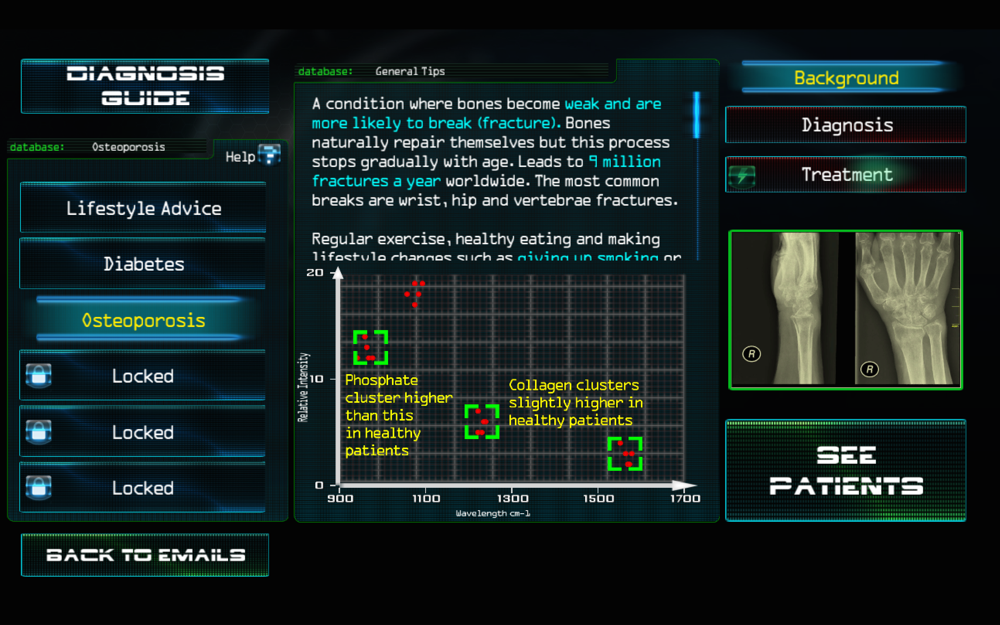

# 

## Factsheet

**Developer:**  
Science: Gamed

**Release Date:**  
Feb 2015

**Website:**  
[sciencegamed.co.uk/games/sors](http://www.sciencegamed.co.uk/games/sors)

**Press / Business contact:**  
[rac@sciencegamed.co.uk][contact]

**Social:**  
[Twitter][twitter]  
[Facebook][facebook]  

**Platforms:**  
PC
Mac

## Description

In the future, the world is on the brink of a population crisis. The world is running out of space. Prison ships float in the sky, citizens move between densely packed skyscrapers using 'pedwalks', and what remains of the ground is all but forgotten as mankind expands towards the sky. Hospitals are strained by the number of patients coming in.

You are a new doctor in a high-tech hospital. But someone is hacking your systems. You need to find out who is behind this, and why, all whilst helping patients so that government healthcare targets are met.

Who will you believe? And how will you respond?

**Game Features:**

- 6 different endings based on player choice
- Depending on player choice, gameplay varies and different challenges are experienced
- Diagnose patients using a graph or False Colour Squares
- Chat to patients to reduce complaints
- Inspired by real science. Information in the game is based on real disease/treatment information

## Videos

The SORS teaser trailer:

<iframe src="http://www.youtube.com/embed/KONHrpCfeiU?rel=0" frameborder="0" allowfullscreen></iframe>

 

Here's some music from our game. The soundtrack can be described as 'futuristic electronica'.
<iframe src="https://www.youtube.com/embed/6IRn6SLs1sE" frameborder="0" allowfullscreen></iframe>

## Images

download all screenshots & photos as ** [.zip (63 KB)](assets/images/images.zip "Images zip") **

## Logo & Icon

download logo files as ** [.zip (7 KB)]( assets/images/logo.zip "Logo & Icon zip") **

## Awards & Recognition

> * "Winner, XX awards." - *game name, December 13, 2013*
> * "Nominee, YY awards." - *game name, December 13, 2013*

## Selected Articles

> * "Quote quote quote."  
-- *Person Name, [Website](http://www.website.com/)*

> * "More quotes."  
-- *Person name, [Site](http://geocities.blog.com/)*

## Additional Links

**Company Link #1**  
Link to your company, or some affiliate. Located [here](https://link)

**Company Link #2**  
Another of these. See [here](https://link)

## Team & Repeating Collaborator

**Probably the founder's name goes here**  
[Founder](https://link)

**Another person's name**  
[developer maybe](https://link)

**Another person, show em if you've got em**  
[artist, who knows](https://link)

**A fourth person**  
[music, sound?](https://link)

## Contact

**Inquiries**  
[press-contact@company.com][contact]

**Twitter**  
[twitter.com/companyname][twitter]

** Facebook**  
[facebook.com/companyname][facebook]

**Web**  
[companydomain.com][homepage]

<!--- =====================================================================  -->
<!--- Referenced links -->

[homepage]:sciencegamed.co.uk "Company Name"

[contact]: mailto:rac@sciencegamed.co.uk

<!--- Social -->

[twitter]: https://twitter.com/ScienceGamed
[facebook]: https://facebook.com/Science-Gamed
[skype]: callto:companyskypename

<!--- Projects  -->

[S.O.R.S]: sciencegamed.co.uk/games/sors
